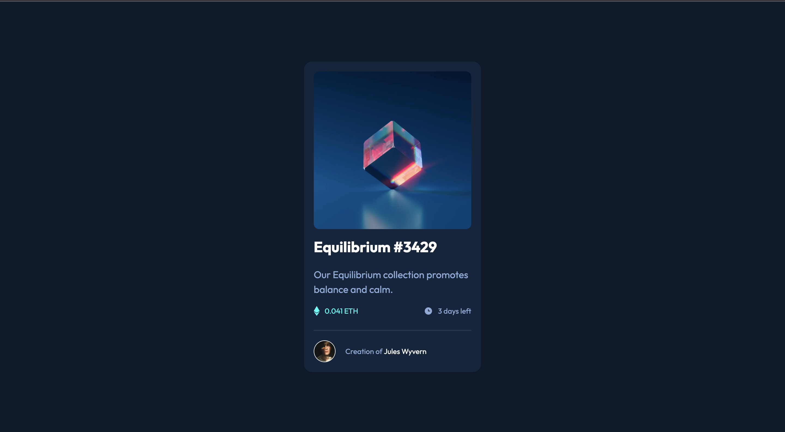

# Frontend Mentor - NFT preview card component solution

This is a solution to the [NFT preview card component challenge on Frontend Mentor](https://www.frontendmentor.io/challenges/nft-preview-card-component-SbdUL_w0U). Frontend Mentor challenges help you improve your coding skills by building realistic projects.

## Table of contents

- [Overview](#overview)
  - [The challenge](#the-challenge)
  - [Screenshot](#screenshot)
  - [Links](#links)
- [My process](#my-process)
  - [Built with](#built-with)
  - [What I learned](#what-i-learned)
- [Author](#author)

## Overview

### The challenge

Users should be able to:

- View the optimal layout depending on their device's screen size
- See hover states for interactive elements

### Screenshot



### Links

- Solution URL: [https://www.frontendmentor.io/solutions/nft-card-component-using-html-and-css-WtIQW5K_bM](https://www.frontendmentor.io/solutions/nft-card-component-using-html-and-css-WtIQW5K_bM)
- Live Site URL: [https://nft-preview-card-component-liart-nu.vercel.app/](https://nft-preview-card-component-liart-nu.vercel.app/)

## My process

### Built with

- Semantic HTML5 markup
- CSS custom properties
- Flexbox
- Mobile-first workflow

### What I learned

I learn how to center an absolutely positioned element in a div. I got the help needed to achieve this on stack overflow.

```css
.child {
  position: absolute;
  top: 50%; /* position the top  edge of the element at the middle of the parent */
  left: 50%; /* position the left edge of the element at the middle of the parent */
  /* This is a shorthand of translateX(-50%) and translateY(-50%) */
  transform: translate(-50%, -50%);
}
```

## Author

- Website - [Samuel Adu](http://portfolio-fawn-zeta.vercel.app/)
- Frontend Mentor - [@theadusamuel](https://www.frontendmentor.io/profile/theadusamuel)
- LinkedIn - [@theadusamuel](https://www.linkedin.com/in/theadusamuel/)
